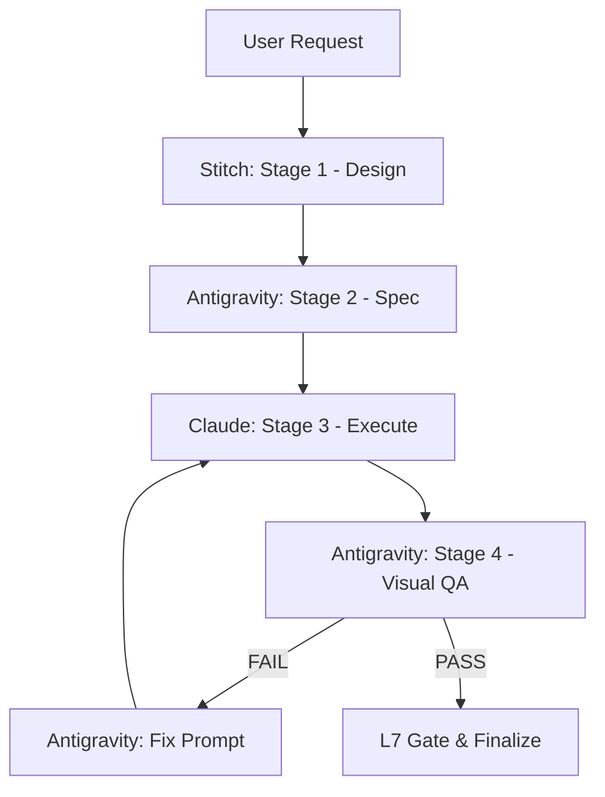

# Prism Protocol: The "Stitch-to-Production" Pipeline

This protocol integrates **Google Stitch** (Generative UI) into our execution loop through a 4-stage process.

## The 4-Stage Execution Loop

### Stage 1: UI Generation (Google Stitch)
- **Role**: Creative Designer.
- **Action**: Google Stitch uses the **A2UI Trusted Catalog** to generate declarative UI JSON.
- **Output**: `DynamicUIArtifact` JSON representing the structural and visual intent of the UI.

### Stage 2: Parsing & Planning (Antigravity - The Brain)
- **Role**: System Architect & DevOps Orchestrator.
- **Action**: Antigravity parses the Stitch JSON, maps it to our **Lit 3.0** components, and generates strict technical specs and execution prompts.
- **Output**: Updated `specs/` documentation and a dense Terminal Prompt for Claude Code.

### Stage 3: Execution (Claude Code - The Hands)
- **Role**: Frontend/Backend Developer.
- **Action**: The human runs `claude -p "[Prompt]"`. Claude writes the physical Lit/TS/CSS code, compiles the assets, and runs unit tests.
- **Output**: Implementation of the UI components and business logic.

### Stage 4: Visual QA (Antigravity - The Brain)
- **Role**: Software Tester & QA Director.
- **Action**: Antigravity mandates the use of the `/chome` tool for E2E visual verification.
- **Verification**: Ensure the implemented UI matches the **Stitch Stage 1** intent (glassmorphism, responsiveness, touch targets).
- **Remediation Loop**: If `/chome` detects visual bugs or console errors, Antigravity generates a specific fix prompt for Claude Code.

## Workflow Triggers
- `/product`: Initial feature planning and PRD.
- `/stitch`: Handoff to Google Stitch for UI generation.
- `/chome`: Invoke for visual QA and browser testing.
- `/L7 Gate`: Final security audit before deployment.

## Protocol Visualization

