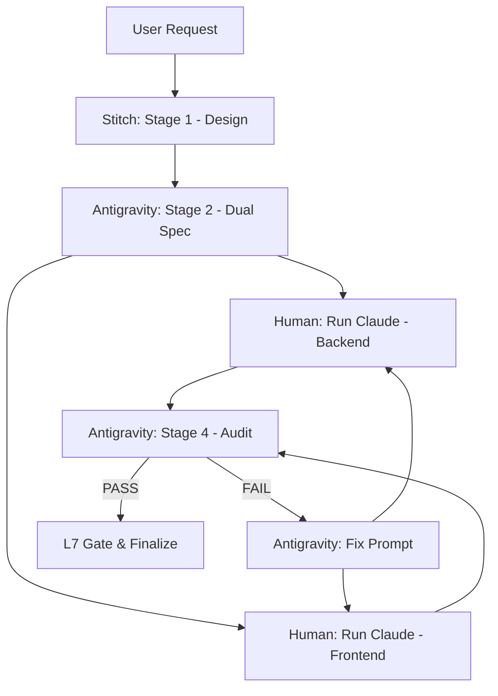

# Prism Protocol: The Dual-Engine Execution Loop

This protocol enforces a strict separation between the **Brain** (Antigravity) and the **Hands** (Claude Code).

## The 5-Stage Execution Loop

### Stage 1: UI Generation (Google Stitch)
- **Role**: Creative Designer.
- **Action**: Google Stitch uses the **A2UI Trusted Catalog** to generate declarative UI JSON.
- **Output**: `DynamicUIArtifact` JSON representing the structural and visual intent.

### Stage 2: Parsing & Planning (Antigravity - The Brain)
- **Role**: System Architect & DevOps Orchestrator.
- **Action**: Antigravity parses the Stitch JSON, maps it to **Lit 3.0** components, and determines if the task requires **Dual-Terminal Execution** (Parallel Backend & Frontend work).
- **Output**: 
    - **Prompt A (Backend)**: Focuses on Go APIs, SQL migrations, and logic.
    - **Prompt B (Frontend)**: Focuses on Lit components, CSS variables, and UI state.

### Stage 3: Execution (Claude Code - The Hands)
- **Role**: Backend/Frontend Developer.
- **Action**: The human opens two terminal sessions.
    - **Session 1**: Run `claude -p "[Prompt A]"`.
    - **Session 2**: Run `claude --fork-session -p "[Prompt B]"` (or separate terminal instance).
- **Parallel Work**: Both Claude instances execute their respective tasks simultaneously.

### Stage 4: Visual QA & Audit (Antigravity - The Brain)
- **Role**: Software Tester & QA Director.
- **Action**: Antigravity mandates the use of `/chome` for E2E visual verification and `make test` for backend verification.
- **Verification**: Ensure the implemented UI matches the **Stitch Stage 1** intent and the API meets the **Stage 2** technical spec.

### Stage 5: Revision & Finalization (The Loop)
- **Outcome (FAIL)**: Antigravity generates a specific "Remediation Prompt" for the relevant terminal session.
- **Outcome (PASS)**: Antigravity authorizes the merge and updates the `ROADMAP.md`.

## Dual-Terminal Protocol Triggers
- **CONCURRENT_DEV**: Triggered when a spec affects both `internal/api/` and `frontend/src/`.
- **FORK_SESSION**: Use `claude --fork-session` to maintain context while isolating execution threads.

## Inter-Thread Protocol

