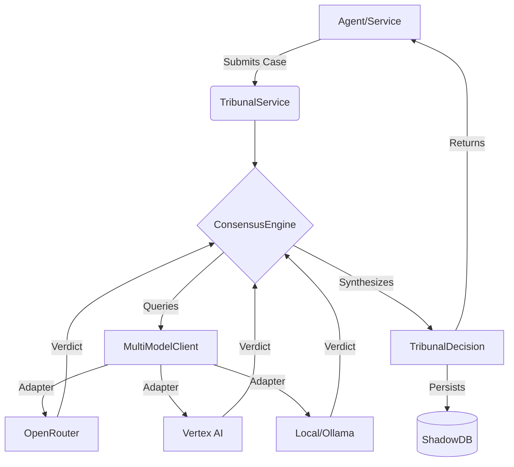

# TRIBUNAL_INTERFACES PRD

**Status**: Draft
**Owner**: Product Orchestrator
**Reviewers**: Principal Engineer, Security Engineer, Research Engineer

## 1. Executive Summary
"The Tribunal" is the authoritative decision-making engine within the FutureShade intelligence layer. It replaces single-model reliance with a multi-model consensus system. By querying multiple LLMs (Jurors) and synthesizing their outputs through configurable logic (The Gavel), The Tribunal provides higher-confidence, hallucination-resistant decisions for critical agentic operations.

## 2. Problem Statement & Goals
**Problem**:
- **Hallucinations**: Single models can confidently state falsehoods.
- **Vendor Lock-in**: Hardcoding to OpenAI or Anthropic creates risk.
- **Opaque Decisions**: "Why did the agent do that?" is often unanswerable.

**Goals**:
- **Model Agnosticism**: Standardized interface for *any* LLM provider (OpenRouter, Vertex, Ollama).
- **Consensus verification**: Mechanisms to cross-examine outputs (e.g., "Do 3 out of 5 models agree?").
- **Auditability**: Every decision must have a `TribunalDecision` record with individual `ModelVerdict`s.

## 3. Architecture Overview



## 4. Functional Requirements

### 4.1 Multi-Model Client (`Juror` Interface)
The system must support pluggable model adapters.

- **Interface Definition**:
    - `Consult(context string, prompt string) (Verdict, error)`
    - `StreamConsult(...)` (Future scope)
- **Supported Providers (MVP)**:
    - **OpenRouter** (Aggregator for Claude 3.5, GPT-4o, Llama 3)
    - **Vertex AI** (Gemini Pro)
    - **Ollama** (Local fallback)
- **Configuration**:
    - Each provider must support `ModelName`, `Temperature`, `MaxTokens`.

### 4.2 Consensus Engine (`TheGavel` Logic)
How the system resolves truth from multiple inputs.

- **Strategies**:
    1.  **`UNANIMOUS`**: All consulted models must return semantically equivalent answers. Fails if *any* disagree. (High criticality)
    2.  **`MAJORITY_RULE`**: >50% of models agree. (Standard operations)
    3.  **`SUPERVISOR`**: One strong model (e.g., Opus) reviews the outputs of smaller models (e.g., Haiku/Flash) and makes the final call.
    4.  **`SINGLE_SHOT`**: Passthrough to a single model (Low criticality, backward compatibility).

- **Conflict Resolution**:
    - If consensus fails, return `ErrHungJury`.
    - Retry logic with higher-capacity model (Escalation).

## 5. Data Models

### 5.1 The Case (Input)
```json
{
  "case_id": "uuid",
  "context": "File: utils.go, Lines: 10-50...",
  "instructions": "Refactor to use generic slice mapping.",
  "required_consensus": "MAJORITY_RULE",
  "jurors": ["gpt-4o", "claude-3-5-sonnet", "gemini-1.5-pro"]
}
```

### 5.2 The Verdict (Individual Output)
```json
{
  "model_id": "claude-3-5-sonnet",
  "content": "Here is the refactored code...",
  "confidence": 0.95,
  "latency_ms": 1200,
  "cost_usd": 0.0004
}
```

### 5.3 TribunalDecision (Final Output)
```json
{
  "decision_id": "uuid",
  "case_id": "uuid",
  "final_ruling": "Here is the refactored code...", // Synthesized or chosen verdict
  "consensus_reached": true,
  "dissenting_opinions": [], // List of rejected verdicts
  "total_cost": 0.0012,
  "duration_ms": 1500
}
```

## 6. UX/UI Flows
*N/A for Backend Interfaces, but affects "Shadow Viewer" (Step 66).*
- **Decision Log**: Admin panel must show the breakdown of every `TribunalDecision`: "Gemini said X, Claude said Y, Tribunal chose X because..."

## 7. Security & Compliance
- **API Key Management**: All provider keys must be stored in the existing Secret Manager/Vault, never in code.
- **Prompt Injection**: The Tribunal must sanitize "User Context" before sending to Jurors to prevent "Ignore previous instructions" attacks.
- **Cost Controls**: Hard limits on `MaxTokens` per request to prevent runaway costs from looping agent calls.

## 8. Success Metrics
- **Consensus Rate**: % of requests that result in a successful decision vs `ErrHungJury`.
- **Latency Overhead**: Time added by the Consensus Engine (Target: < 500ms overhead + slowest model latency).
- **Cost Efficiency**: Average cost per high-confidence decision.
