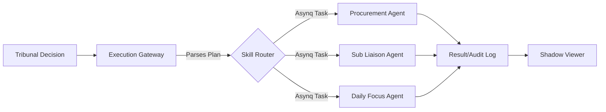

# FUTURESHADE_AGENTS PRD

**Status**: Published
**Owner**: Product Orchestrator
**Task ID**: `FUTURESHADE_AGENTS`
**Roadmap Step**: 67

## 1. Executive Summary
FutureShade's intelligence layer currently possesses a "Decision" mechanism (The Tribunal). However, it lacks a standard "Execution" path to act on those decisions. This PRD defines the **Agent Skill Registry** and the **Execution Gateway**, which allow FutureShade to invoke the `internal/agents` (Antigravity Skills) to implement remediation plans, automated fixes, and business logic updates.

## 2. Problem Statement
- **Decision/Action Gap**: The Tribunal can decide *what* to do, but has no way to actually *do* it without human intervention.
- **Tightly Coupled Execution**: Calling agents directly from the Tribunal logic violates separation of concerns.
- **Lack of Verification**: No automated way to confirm if an agent successfully executed the Tribunal's plan.

## 3. Goals
- **Standardized Skill Interface**: Treat every agent in `internal/agents` as a "Skill" that can be registered and called.
- **Asynchronous Execution**: Use the existing Asynq background job system for reliable skill execution.
- **Closed-Loop Audit**: Track the full lifecycle: `Decision Approved` -> `Skill Enqueued` -> `Skill Executed` -> `Result Verified`.

## 4. Architecture: The Action Bridge

### 4.1 Skill Registry
A central registry in `internal/futureshade/skills` that maps "Skill Names" (e.g., `PROCUREMENT_SYNC`, `RECALCULATE_SCHEDULE`) to their respective implementations in `internal/agents`.

### 4.2 Execution Gateway
The component that parses the Tribunal's `RemediationPlan` and converts it into a set of Skill invocations.



## 5. Functional Requirements

### 5.1 The Agent Skill Interface
Every agent to be used by FutureShade must implement a standard `Skill` interface:
```go
type Skill interface {
    Name() string
    Execute(ctx context.Context, params map[string]interface{}) (Result, error)
}
```

### 5.2 Plan Parsing
The Execution Gateway must support parsing the `RemediationPlan` (likely in JSON format) returned by the Tribunal:
- **Command Selection**: Identifying which Skill to call.
- **Parameter Extraction**: Extracting project IDs, task IDs, or configuration overrides from the plan.
- **Risk Validation**: Blocking actions that exceed specific risk thresholds (e.g., "Delete all tasks").

### 5.3 Asynq Integration
- Skills should be enqueued as background tasks to prevent blocking the Tribunal's consensus loop.
- Use Task Types like `task:skill_execution`.
- Support retries and backoff for transient failures (e.g., DB deadlocks).

### 5.4 Audit & Feedback
- Every action taken by an agent via FutureShade must be logged in the `shadow_audit_trail` table.
- Results (Success/Failure + logs) must be viewable in the Shadow Viewer decisions log.

## 6. Data Models

### 6.1 Skill Execution Record
```json
{
  "execution_id": "uuid",
  "decision_id": "uuid",
  "skill_name": "PROCUREMENT_SYNC",
  "parameters": {
    "project_id": "uuid",
    "batch_size": 250
  },
  "status": "COMPLETED",
  "result_summary": "Processed 124 items. 2 alerts sent.",
  "started_at": "timestamp",
  "finished_at": "timestamp"
}
```

## 7. Security & Governance
- **RBAC**: Only "Approved" Tribunal decisions can trigger Skill execution.
- **Circuit Breaker**: Ability to globally disable FutureShade execution if misbehavior is detected.
- **Human-in-the-Loop (HITL)**: High-risk skills (e.g., financial updates) require manual approval in the Shadow Viewer before execution.

## 8. Success Metrics
- **Execution Reliability**: >99% of enqueued skills complete successfully.
- **Latency**: Time from "Consensus Reached" to "Skill Enqueued" < 500ms.
- **Audit Coverage**: 100% of FutureShade-triggered actions have a traceable audit record.

---

**Next Step**: Invoke `/devteam FUTURESHADE_AGENTS` to design the `AgentRegistry` and `ExecutionGateway` implementations.
