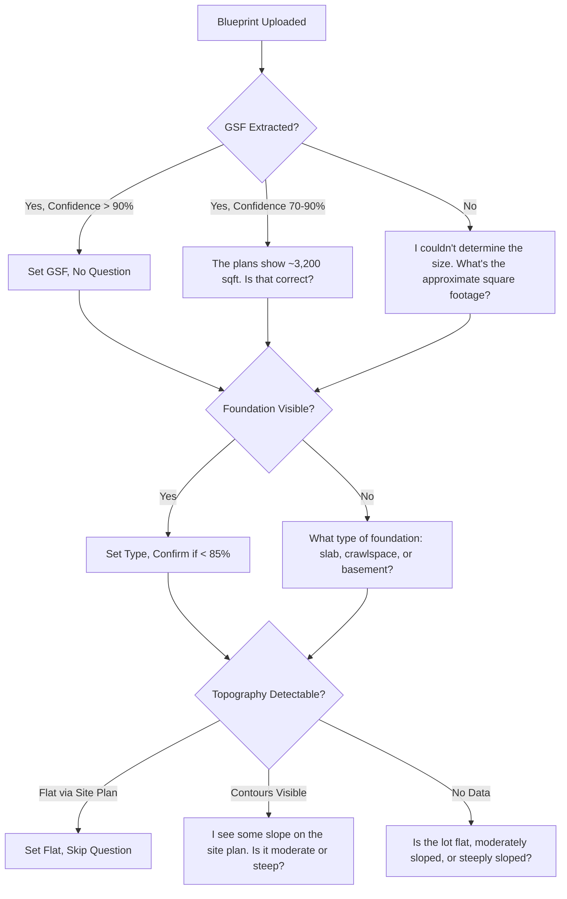
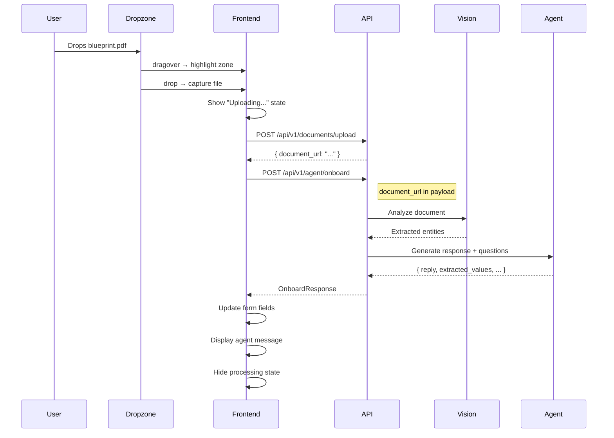

# Product Requirements Document: The Conversational Hook (Phase 11)

| Metadata | Details |
| :--- | :--- |
| **Phase** | Phase 11: The Conversational Hook (Smart Onboarding) |
| **Goal** | Replace manual project creation forms with a "Chat + Upload" wizard where Agent 2 interviews the user to build the project spec. |
| **Status** | **PLANNING** |
| **Owner** | Product Orchestrator |
| **Authors** | Antigravity, User |
| **Related Roadmap Items** | Steps 74-77 |
| **Estimated Duration** | 4.5 Days |

---

## 1. Executive Summary

Phase 11 represents a **paradigm shift** in project onboarding—from passive form-filling to an **AI-driven conversational experience**. The current `fb-project-dialog` requires users to manually input project details through traditional form fields. Phase 11 transforms this into an intelligent interview process where "The Interrogator" (Agent 2) actively guides users through project setup, asks clarifying questions, and auto-populates structured data in real-time.

This phase directly addresses **Gap 1 (Creation Workflow)** from the product roadmap and implements the "Conversation First" principle from the Definition of Done for Beta.

### Key Outcomes
- **Zero-friction project creation**: Drag a blueprint → Answer a few questions → Project ready.
- **Data Quality**: AI extracts and validates data, reducing human input errors.
- **Immediate AI Value**: Users experience the AI's intelligence from their very first interaction.

---

## 2. Problem Statement

### 2.1 The "Cold Start" Problem
The current project creation flow (see [PROJECT_ONBOARDING_SPEC.md](file:///home/colton/Desktop/FutureBuild_HQ/dev/specs/PROJECT_ONBOARDING_SPEC.md)) is a traditional form:
- User clicks "New Project"
- User manually fills: Name, Address, Square Footage
- User submits → Project is created with **minimal data**

**Result**: Projects are created with placeholder data, requiring extensive manual refinement later. The user doesn't experience AI value until *after* tedious setup.

### 2.2 The "Dumb Upload" Gap
Users *can* upload blueprints, but the current flow doesn't leverage document intelligence:
- Uploaded files sit in storage
- No automatic data extraction
- No connection between uploaded content and project attributes

### 2.3 The Interrogation Opportunity
Construction blueprints contain rich structured data (room counts, dimensions, specifications) that could auto-populate 80% of project configuration **if** we had an AI capable of:
1. Parsing the document
2. Asking **targeted clarifying questions** (e.g., "I see 3 bathrooms—is one a master en-suite?")
3. Real-time form population

---

## 3. Goals & Success Metrics

### 3.1 Primary Goals

| Goal | Description |
| :--- | :--- |
| **Conversational Onboarding** | Replace the static form with a split-screen wizard where Chat (left) drives Form (right). |
| **Intelligent Extraction** | Agent 2 extracts project details from uploaded blueprints and asks clarifying questions. |
| **Real-Time Sync** | Form fields update live as the AI extracts and confirms data. |
| **Magic Upload** | Dragging a PDF onto the wizard immediately triggers document analysis. |

### 3.2 Success Metrics

| Metric | Target | Measurement Strategy |
| :--- | :--- | :--- |
| **Form Completion Time** | < 90 seconds (with blueprint) | Timestamp from wizard open to project creation |
| **Auto-Populated Fields** | ≥ 6/10 fields | Count of fields populated by AI vs. manual |
| **User Corrections** | < 20% of extracted values | Track field edits post-extraction |
| **Blueprint Recognition** | 100% valid PDFs trigger workflow | Drop event → API call success rate |
| **Clarification Accuracy** | ≥ 90% relevant questions | User feedback / skip rate on questions |

---

## 4. User Stories

### 4.1 The Blueprint Drop
> "As a Builder, I want to drag my architectural PDF into the onboarding wizard so the AI reads it and fills in the project details automatically."

**Acceptance Criteria:**
- [ ] Dragging a `.pdf` or `.png` onto the wizard triggers document analysis
- [ ] A "Processing..." state shows while extraction occurs
- [ ] Extracted values auto-populate form fields with visual highlight

### 4.2 The Clarifying Conversation
> "As a Project Manager, I want the AI to ask smart follow-up questions about my blueprints so the project data is accurate without me reviewing every field manually."

**Acceptance Criteria:**
- [ ] Agent asks context-aware questions (e.g., "Is the 4th bedroom an office?")
- [ ] User answers populate or refine corresponding form fields
- [ ] Conversation history is preserved for later reference

### 4.3 The Quick Start
> "As a busy Superintendent, I want to create a project by just providing a name and address, letting the AI fill defaults, so I can get started immediately."

**Acceptance Criteria:**
- [ ] Wizard can complete with minimal required fields (Name, Address)
- [ ] Agent offers to refine later: "I've created your project. Want to upload plans now or later?"
- [ ] Progressive disclosure: details can be added conversationally post-creation

---

## 5. Functional Requirements

### 5.1 Split-Screen Wizard Component (Step 74)

**Component Name:** `<fb-view-onboarding>`

**Layout:**
```
┌────────────────────────────────────────────────────────────────┐
│  [Logo]          New Project Wizard              [Close X]     │
├─────────────────────────────┬──────────────────────────────────┤
│                             │                                  │
│  💬 CHAT PANEL              │  📋 LIVE FORM                    │
│                             │                                  │
│  Agent: "Hi! Let's set up   │  ┌────────────────────────────┐ │
│  your new project. You can  │  │ Project Name: [________]   │ │
│  tell me about it or drag   │  │ Address: [______________]  │ │
│  a blueprint here."         │  │ Square Feet: [____]        │ │
│                             │  │ Bedrooms: [__]             │ │
│  [Drop Zone: "Drop PDF"]    │  │ Bathrooms: [__]            │ │
│                             │  │ Stories: [__]              │ │
│  ─────────────────────────  │  │ Start Date: [__/__/____]   │ │
│  User: "It's a 3,200 sqft   │  │ ──────────────────────     │ │
│  custom home in Austin"     │  │ Foundation: [dropdown]     │ │
│                             │  │ Roof Type: [dropdown]      │ │
│  Agent: "Got it! I've set   │  │ HVAC: [dropdown]           │ │
│  the location to Austin,    │  └────────────────────────────┘ │
│  TX and sqft to 3,200.      │                                  │
│  How many bedrooms?"        │  [────── Create Project ──────]  │
│                             │                                  │
│  ┌─────────────────────┐    │                                  │
│  │ Type here...   [📎] │    │                                  │
│  └─────────────────────┘    │                                  │
│                             │                                  │
└─────────────────────────────┴──────────────────────────────────┘
```

**Responsive Behavior:**

| Breakpoint | Layout |
| :--- | :--- |
| **Desktop (≥1024px)** | Side-by-side: Chat (50%) + Form (50%) |
| **Tablet (768-1023px)** | Stacked: Chat on top, Form below (scrollable) |
| **Mobile (<768px)** | Tab toggle between Chat and Form views |

**Sub-Components:**
- `<fb-onboarding-chat>`: Reuses `<fb-message-list>` and `<fb-input-bar>` from Phase 10
- `<fb-onboarding-form>`: Smart form with field-level reactivity to chat state
- `<fb-onboarding-dropzone>`: Styled drag-and-drop area within chat panel

**Transitions:**
- Field updates animate with a subtle glow (300ms ease-out)
- Chat auto-scrolls on new message
- Form fields highlight briefly when AI-populated (distinct from user-edited)

---

### 5.2 "The Interrogator" Agent Logic (Step 75)

**Agent Identity:** Agent 2 (The Interrogator) — specialized for project onboarding

**Backend Endpoint:**
```
POST /api/v1/agent/onboard
{
  "project_id": "temp_<uuid>",  // Temporary ID until creation
  "message": "string",          // User input or empty for document upload
  "document_url": "string?",    // If blueprint uploaded
  "current_state": {            // Current form state for context
    "name": "string?",
    "address": "string?",
    "square_footage": "number?",
    ...
  }
}

Response:
{
  "reply": "string",           // Agent message to display
  "extracted_values": {        // Values to populate in form
    "name": "string?",
    "address": "string?",
    "square_footage": "number?",
    "bedrooms": "number?",
    "bathrooms": "number?",
    "stories": "number?",
    ...
  },
  "confidence_scores": {       // For UI indicators
    "square_footage": 0.95,
    "bedrooms": 0.78,
    ...
  },
  "clarifying_question": "string?", // Next question if needed
  "ready_to_create": boolean   // True when minimum fields satisfied
}
```

**Interrogation Logic Flow:**
```mermaid
graph TD
    A[User Opens Wizard] --> B{Document Uploaded?}
    B -->|Yes| C[Send to Vision API]
    B -->|No| D[Prompt for Project Name]
    C --> E[Extract Structured Data]
    E --> F{Confidence < 80%?}
    F -->|Yes| G[Generate Clarifying Question]
    F -->|No| H[Populate Form Field]
    G --> I[Wait for User Response]
    I --> J[Update Field + Next Question]
    D --> K[Parse User Input]
    K --> L[Entity Extraction]
    L --> H
    H --> M{All Required Fields?}
    M -->|Yes| N[Enable "Create Project"]
    M -->|No| O[Ask Next Priority Question]
    O --> I
```

**Question Priority Order:**
1. **Name** (Required) — "What would you like to call this project?"
2. **Address** (Required) — "Where is it located?"
3. **Square Footage** — "What's the approximate size in square feet?"
4. **Bedrooms** — "How many bedrooms?"
5. **Bathrooms** — "Number of bathrooms?"
6. **Stories** — "Single story or multi-story?"
7. **Start Date** — "When do you plan to break ground?"

**Clarifying Question Examples:**
| Extracted Data | Confidence | Question Generated |
| :--- | :--- | :--- |
| `bathrooms: 3` | 85% | "I found 3 bathrooms. Is one of them a master en-suite?" |
| `bedrooms: 4` | 72% | "I see 4 potential bedrooms. One looks like it might be an office—should I count it as a bedroom?" |
| `square_footage: null` | — | "I couldn't determine the square footage from the plans. What's your estimate?" |
| `garage: "attached"` | 95% | *(No question—high confidence)* |

---

### 5.3 Real-Time Form Filling (Step 76)

**State Management:**
The onboarding wizard maintains synchronized state between chat and form:

```typescript
interface OnboardingState {
  // Form values
  values: Partial<CreateProjectRequest>;
  
  // Source tracking (for visual distinction)
  sources: Record<keyof CreateProjectRequest, 'user' | 'ai' | 'default'>;
  
  // AI confidence per field
  confidence: Record<keyof CreateProjectRequest, number>;
  
  // Chat history
  messages: ChatMessage[];
  
  // Wizard state
  isProcessing: boolean;
  isReadyToCreate: boolean;
}
```

**Visual State Indicators:**

| Source | Visual Treatment |
| :--- | :--- |
| **AI-Populated** | Blue left border + sparkle icon ✨ + "(AI)" label |
| **User-Edited** | Normal styling (user override clears AI indicator) |
| **Default Value** | Muted text + "(Default)" label |
| **Low Confidence** | Yellow left border + "Verify" badge |

**Real-Time Update Behavior:**
1. Agent response arrives with `extracted_values`
2. For each value in response:
   - If field is empty → populate + animate glow
   - If field has user value → skip (don't overwrite user input)
   - If confidence < 80% → show "Verify" badge
3. Form validates → enable/disable "Create Project" button
4. Chat displays agent message

---

### 5.5 Physics Engine Data Mapping (Critical Integration)

**Purpose:** The Interrogator Agent must collect data that directly feeds the Layer 3 Physics Engine (CPM-res1.0). Without these inputs, schedule calculations will use defaults that may be significantly inaccurate.

#### 5.5.1 DHSM Calculator Inputs (Duration-Hours-Scope-Multiplier)

| Physics Variable | UI Question | Extraction Method | Default | Impact on Schedule |
| :--- | :--- | :--- | :--- | :--- |
| **`gsf` (Gross Square Feet)** | "What's the approximate square footage?" | Blueprint extraction → Validate with user | 2,250 sqft | **SAF = (GSF / 2250)^0.75** — Scales all task durations non-linearly |
| **`foundation_type`** | "What type of foundation? Slab, crawlspace, or basement?" | Blueprint analysis | `slab` | +8 days (crawl) or +25 days (basement) to WBS 8.0-8.11 |
| **`stories`** | "Single story or multi-story?" | Blueprint floor count | 1 | Affects framing duration (WBS 9.x) |
| **`topography`** | "Is the lot flat, moderately sloped, or steeply sloped?" | Address geocoding + user confirmation | `flat` | +10 days (moderate) or +30 days (steep) to WBS 7.3, 8.0 |
| **`soil_conditions`** | "Any special soil conditions? Rock, clay, or standard?" | Address-based inference OR user input | `standard` | +15 days for poor/rock to WBS 8.0 |
| **`zip_code`** | "Project location/address?" | Address parsing | — | Required for weather service (SWIM model) |
| **`climate_zone`** | Auto-derived from zip_code | Address → IECC zone lookup | — | Determines weather adjustment multipliers |

#### 5.5.2 Procurement Calculator Inputs

| Physics Variable | UI Question | Extraction Method | Default | Impact on Schedule |
| :--- | :--- | :--- | :--- | :--- |
| **`supply_chain_volatility`** | "Any supply chain concerns for this project?" | User sentiment → map to 1-3 | 1 (stable) | Buffer = 5 days × SCV; affects all procurement lead times |
| **Window/Door Selection** | "Standard or custom windows?" | Blueprint spec extraction | standard | Lead time: 8-20 weeks (WBS 6.1) |
| **HVAC System** | "What type of HVAC? Central, mini-split, or radiant?" | Blueprint MEP extraction | central | Lead time: 6-12 weeks (WBS 6.2) |
| **Cabinetry** | "Stock cabinets or custom?" | User input OR design doc | stock | Lead time: 10-16 weeks (WBS 6.5) |

#### 5.5.3 Inspection Gate Inputs

| Physics Variable | UI Question | Extraction Method | Default | Impact on Schedule |
| :--- | :--- | :--- | :--- | :--- |
| **`rough_inspection_latency`** | "How responsive is your local building department?" | User experience → map to days | +1 day | Added to WBS 8.2, 8.5, 9.7, 10.4 |
| **`final_inspection_latency`** | "Any known permitting delays in this jurisdiction?" | User experience → map to days | +5 days | Added to WBS 14.1 |
| **Regulatory Hurdles** | "Any special permits needed? (Historic, wetlands, HOA)" | User input | None | +30 to +180 days static adder |

#### 5.5.4 Interrogation Priority Matrix

The Interrogator must collect data in order of **schedule impact**:

| Priority | Data Point | Schedule Impact (days) | Collection Method |
| :--- | :--- | :--- | :--- |
| **P0** | `gsf` | ±30-50 days variance | Blueprint extraction → confirm |
| **P0** | `foundation_type` | +0/8/25 days | Blueprint section view → confirm |
| **P0** | `address` / `zip_code` | Enables weather model | User input (required) |
| **P1** | `topography` | +0/10/30 days | Geocode + satellite imagery → confirm |
| **P1** | `stories` | ±5-10 days | Blueprint extraction → confirm |
| **P1** | `soil_conditions` | +0/15 days | Geocode soil data → confirm |
| **P2** | `supply_chain_volatility` | ±5-15 days buffer | Sentiment question |
| **P2** | `inspection_latency` | ±1-10 days | Jurisdiction lookup → confirm |
| **P3** | Long-lead selections | Affects procurement timing | Document extraction or defer |

#### 5.5.5 Smart Extraction Strategy

**Blueprint Analysis Targets:**
```
From Title Block:
- Project Name
- Address
- GSF (Gross Square Footage)
- Stories/Levels

From Site Plan:
- Topography indicators
- Foundation callouts

From Floor Plans:
- Bedroom count
- Bathroom count
- Garage configuration

From Elevations:
- Roof type/pitch
- Siding/cladding type
- Stories confirmation

From Sections:
- Foundation type (slab vs crawl vs basement)
- Ceiling heights
```

**Clarifying Question Logic:**



#### 5.5.6 Minimum Viable Project Context

For the physics engine to generate a **meaningful** schedule, these fields are **required** (with fallback defaults):

| Field | Required? | Fallback Default | Risk if Defaulted |
| :--- | :--- | :--- | :--- |
| `name` | ✅ Yes | — | Cannot create project |
| `address` | ✅ Yes | — | No weather data, no geocoding |
| `gsf` | Recommended | 2,250 sqft | SAF = 1.0; may under/overestimate by 20-40% |
| `foundation_type` | Recommended | `slab` | May miss 8-25 days if actually crawl/basement |
| `stories` | Recommended | 1 | May underestimate framing by 5-10 days |
| `start_date` | Optional | Today + 14 days | Schedule starts from this anchor |

**Agent Behavior:** If user wants to proceed with minimal data, the Interrogator should warn:

> "I can create your project with the basics, but I'm using default values for foundation (slab) and size (2,250 sqft). If these are wrong, your schedule could be off by 3-4 weeks. Want to refine now or later?"

---

### 5.6 Magic Upload Trigger (Step 77)

**Trigger Conditions:**
- File type: `.pdf`, `.png`, `.jpg`, `.jpeg`
- Drop zone: Dedicated dropzone in chat panel OR global wizard area
- Maximum file size: 50MB
- Supported document types: Floor plans, blueprints, architectural drawings

**Upload Workflow:**


**UI States:**

| State | Visual |
| :--- | :--- |
| **Idle** | Dashed border dropzone: "Drop blueprint here or click to upload" |
| **Drag Hover** | Solid border + background highlight + "Drop to analyze" |
| **Uploading** | Progress bar + "Uploading blueprint.pdf..." |
| **Analyzing** | Skeleton shimmer on form + "Reading your plans..." in chat |
| **Complete** | Form populated + Agent summary message |
| **Error** | Red toast: "Couldn't read that file. Try a clearer scan." |

---

## 6. Data Models

### 6.1 Extended CreateProjectRequest

```typescript
interface CreateProjectRequest {
  // Required Fields
  name: string;
  address: string;
  
  // AI-Extractable Fields
  square_footage?: number;
  bedrooms?: number;
  bathrooms?: number;
  stories?: number;
  garage_type?: 'attached' | 'detached' | 'none';
  foundation_type?: 'slab' | 'crawl' | 'basement';
  roof_type?: 'shingle' | 'metal' | 'tile' | 'flat';
  
  // Scheduling
  start_date?: string; // ISO-8601
  target_completion?: string;
  
  // Metadata
  source_documents?: string[]; // URLs to uploaded files
  extraction_confidence?: Record<string, number>;
}
```

### 6.2 OnboardingSession (Backend)

```typescript
interface OnboardingSession {
  id: string;                    // Temporary session ID
  tenant_id: string;
  user_id: string;
  created_at: string;
  
  // Accumulated state
  form_state: Partial<CreateProjectRequest>;
  extraction_history: ExtractionResult[];
  conversation: ChatMessage[];
  
  // Status
  status: 'in_progress' | 'completed' | 'abandoned';
  completed_project_id?: string;
}
```

---

## 7. API Contracts

### 7.1 Onboarding Agent Endpoint

**Endpoint:** `POST /api/v1/agent/onboard`

**Request:**
```json
{
  "session_id": "temp_abc123",
  "message": "It's a 2-story home with 4 bedrooms",
  "document_url": null,
  "current_state": {
    "name": "Smith Residence",
    "address": null
  }
}
```

**Response:**
```json
{
  "session_id": "temp_abc123",
  "reply": "Great! A 4-bedroom, 2-story home. Where is this project located?",
  "extracted_values": {
    "bedrooms": 4,
    "stories": 2
  },
  "confidence_scores": {
    "bedrooms": 0.95,
    "stories": 0.90
  },
  "clarifying_question": null,
  "ready_to_create": false,
  "next_priority_field": "address"
}
```

### 7.2 Document Upload Endpoint

**Endpoint:** `POST /api/v1/documents/upload` (existing)

**Request:** Multipart form with file

**Response:**
```json
{
  "document_id": "doc_xyz789",
  "document_url": "https://storage.futurebuild.ai/uploads/doc_xyz789.pdf",
  "file_type": "application/pdf",
  "file_size_bytes": 2457600
}
```

---

## 8. Edge Cases & Error Handling

| Scenario | Handling |
| :--- | :--- |
| **Unsupported file type** | Toast: "Please upload a PDF or image file" |
| **Corrupt/unreadable PDF** | Agent: "I couldn't read that file. Could you try a clearer scan or describe the project?" |
| **Very large file (>50MB)** | Block upload: "File too large. Maximum size is 50MB." |
| **Network error during upload** | Retry button + error message |
| **Agent extraction fails** | Graceful degradation to manual form with message |
| **Session timeout (15 min)** | Prompt to continue or start fresh |
| **Duplicate project name** | Agent suggests alternative: "There's already a 'Smith Residence'. How about 'Smith Residence 2'?" |
| **Invalid address format** | Agent asks for clarification: "Could you provide the full street address?" |

---

## 9. Implementation Plan

### 9.1 Frontend Development

| Day | Task | Component |
| :--- | :--- | :--- |
| **Day 1** | Create `fb-view-onboarding` with split-screen layout | `fb-view-onboarding.ts` |
| **Day 1** | Implement responsive breakpoints | CSS |
| **Day 1** | Wire `fb-onboarding-chat` (reuse fb-message-list) | `fb-onboarding-chat.ts` |
| **Day 2** | Build `fb-onboarding-form` with reactive fields | `fb-onboarding-form.ts` |
| **Day 2** | Implement field source tracking + visual indicators | CSS + State |
| **Day 2** | Add `fb-onboarding-dropzone` with states | `fb-onboarding-dropzone.ts` |
| **Day 3** | Wire form ↔ chat state synchronization | Store/Signals |
| **Day 3** | Integrate with onboard API endpoint | API Client |

### 9.2 Backend Development

| Day | Task | Service |
| :--- | :--- | :--- |
| **Day 1** | Implement `/api/v1/agent/onboard` endpoint | `agent_service.go` |
| **Day 1** | Create OnboardingSession model + repository | `onboarding_repository.go` |
| **Day 2** | Implement "Interrogator" prompt engineering | `interrogator_agent.go` |
| **Day 2** | Wire Vision API for document extraction | `vision_service.go` |
| **Day 2** | Build clarifying question generator | `interrogator_agent.go` |

### 9.3 Integration

| Day | Task |
| :--- | :--- |
| **Day 3** | End-to-end testing: Upload → Extract → Form |
| **Day 3** | Polish animations and transitions |
| **Day 3** | Error handling and edge case testing |

---

## 10. Dependencies

### 10.1 Phase 10 Prerequisites
- [x] `<fb-message-list>` component (Step 72)
- [x] `<fb-input-bar>` component (Step 72)
- [x] `api.chat.send` wiring (Step 73)
- [x] File drop event handling (Step 73)

### 10.2 External Dependencies
- **Vision API**: Document OCR and entity extraction (GCP Document AI or similar)
- **LLM Integration**: Gemini for conversational flow and clarifying questions

---

## 11. Acceptance Criteria (Definition of Done)

- [ ] **Wizard Renders**: `fb-view-onboarding` displays correctly at all breakpoints
- [ ] **Chat Works**: User can send messages and receive agent responses
- [ ] **Form Syncs**: Extracted values auto-populate form fields in real-time
- [ ] **Visual Feedback**: AI-populated fields are visually distinct from user inputs
- [ ] **Blueprint Drop**: Dropping a PDF triggers document analysis
- [ ] **Processing States**: All loading/processing states are clearly indicated
- [ ] **Error Handling**: All error cases display user-friendly messages
- [ ] **Project Creation**: Completing wizard creates a valid project in the database
- [ ] **Navigation**: After creation, user is routed to the new project dashboard
- [ ] **No Form Required First**: Conversation can complete project creation without user touching form fields

---

## 12. Future Considerations (Out of Scope for Phase 11)

- **Voice Input**: "Describe your project" via voice recording
- **Multi-Document Upload**: Upload floor plan + spec sheet together
- **Template Matching**: Suggest similar past projects
- **Collaborative Onboarding**: Share wizard session with team members
- **Offline Drafts**: Save incomplete projects for later

---

## 13. Inter-Thread Handoff

PRD for `PHASE_11_SMART_ONBOARDING` is complete and ready for technical design.

**Next Step**: Invoke `/devteam PHASE_11_SMART_ONBOARDING` to generate the technical specifications.

**Input Artifact**: `planning/PHASE_11_PRD.md`
