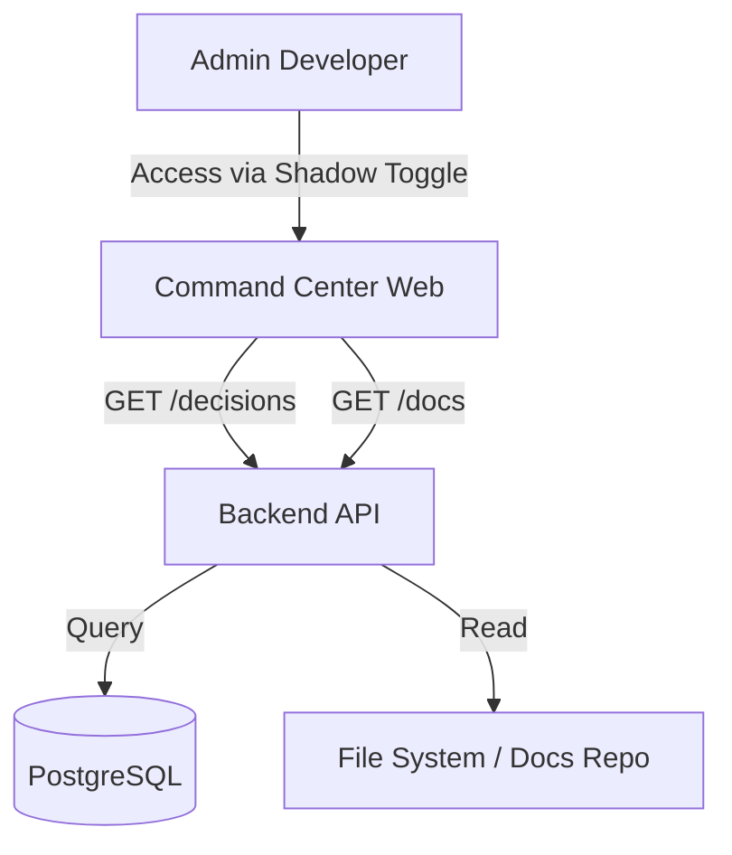

# Technical Specifications: Shadow Viewer

**Status**: Draft
**Owner**: DevTeam (Architect)
**Source**: `docs/SHADOW_VIEWER_PRD.md`

---

## 1. Overview

The **Shadow Viewer** is a specialized, high-privilege operational dashboard within the FutureBuild Command Center. It exposes the internal decision-making process of the "Tribunal" (Multi-Model Consensus System) and provides in-app access to system documentation ("ShadowDocs").

**Goal**: Transform the AI from a black box into an auditable teammate by visualizing consensus votes and reasoning.

---

## 2. Architecture

### 2.1 High-Level Design

The Shadow Viewer module sits within the existing Command Center application (`futurebuild-web`) but operates in a distinct "Shadow Mode". It consumes data from the `TribunalService` via the Backend API.



### 2.2 Integration Boundaries

-   **Frontend**: Implemented as a set of new Lit components under `src/components/shadow/`.
-   **Backend**: New handlers in `internal/api/shadow/` and `internal/api/tribunal/`.
-   **Data**: Accesses `tribunal_decisions` table and the local `docs/` directory.

---

## 3. API Specification

### 3.1 Tribunal Decisions

**GET /api/v1/tribunal/decisions**
*List recent Tribunal decisions with filtering.*

-   **QueryParams**:
    -   `limit` (int, default 20)
    -   `offset` (int, default 0)
    -   `status` (enum: `APPROVED`, `REJECTED`, `CONFLICT`)
    -   `model` (string, filter by participating model)
    -   `start_date` (ISO8601, e.g., `2023-10-27T00:00:00Z`)
    -   `end_date` (ISO8601)
    -   `search` (string, simple text match on context summary)
-   **Response**: `200 OK`
    ```json
    {
      "decisions": [
        {
          "id": "dec_12345",
          "case_id": "case_abc",
          "status": "REJECTED",
          "context": "Refactor utils.go",
          "timestamp": "2023-10-27T10:00:00Z",
          "models_consulted": ["claude-3-opus", "gemini-pro"]
        }
      ],
      "total": 150,
      "has_more": true
    }
    ```
-   **Errors**: `403 Forbidden` (Role < DEVELOPER)

**GET /api/v1/tribunal/decisions/{id}**
*Get full details of a specific decision, including individual model votes.*

-   **Response**: `200 OK`
    ```json
    {
      "id": "dec_12345",
      "status": "REJECTED",
      "consensus_score": 0.2,
      "votes": [
        {
          "model": "claude-3-opus",
          "vote": "VOTE_YEA",
          "reasoning": "Code looks good.",
          "latency_ms": 450,
          "cost_usd": 0.002
        },
        {
          "model": "gemini-pro",
          "vote": "VOTE_NAY",
          "reasoning": "Security vulnerability detected. See [Security Policy v2](docs/security/POLICY.md).",
          "latency_ms": 320,
          "cost_usd": 0.0005
        }
      ],
      "policy_links": ["docs/security/POLICY.md"]
    }
    ```
-   **Errors**: `404 Not Found`

### 3.2 ShadowDocs

**GET /api/v1/shadow/docs/tree**
*Get a recursive file tree of the `docs/` and `specs/` directories.*

-   **Response**: `200 OK`
    ```json
    {
      "root": {
        "name": "docs",
        "type": "dir",
        "children": [
          { "name": "SHADOW_VIEWER_PRD.md", "type": "file", "path": "docs/SHADOW_VIEWER_PRD.md" }
        ]
      }
    }
    ```

**GET /api/v1/shadow/docs/content?path={path}**
*Get the raw markdown content of a file.*

-   **QueryParams**: `path` (relative path)
-   **Response**: `200 OK`
    ```json
    {
      "path": "docs/SHADOW_VIEWER_PRD.md",
      "content": "# SHADOW_VIEWER PRD..."
    }
    ```
-   **Errors**: `400 Bad Request` (Invalid path/Traversal attempt), `403 Forbidden`

---

## 4. Data Model

### 4.1 Database Schema (PostgreSQL)

**Table: `tribunal_decisions`**
*Stores the high-level outcome.*
-   `id` (UUID, PK)
-   `case_id` (VARCHAR, Index)
-   `context_summary` (TEXT)
-   `status` (ENUM: APPROVED, REJECTED, CONFLICT)
-   `consensus_score` (FLOAT)
-   `created_at` (TIMESTAMPTZ, Index)
-   **Indexes**: `(status, created_at)` for filtering.

**Table: `tribunal_votes`**
*Stores individual model votes.*
-   `id` (UUID, PK)
-   `decision_id` (UUID, FK -> tribunal_decisions)
-   `model_name` (VARCHAR)
-   `vote` (ENUM: YEA, NAY, ABSTAIN)
-   `reasoning` (TEXT)
-   `latency_ms` (INT)
-   `token_count` (INT)
-   `cost_usd` (DECIMAL)

### 4.2 Go Structs (Reference)

```go
type TribunalDecision struct {
    ID             uuid.UUID      `json:"id"`
    Status         DecisionStatus `json:"status"` // "APPROVED" | "REJECTED" | "CONFLICT"
    Context        string         `json:"context"`
    Timestamp      time.Time      `json:"timestamp"`
    Votes          []ModelVote    `json:"votes,omitempty"`
}
```

---

## 5. Frontend Architecture

### 5.1 Components (Lit)

1.  **`shadow-toggle`**:
    -   **Location**: `fb-panel-left` (System section).
    -   **Action**: Toggles application mode between "Standard" and "Shadow".

2.  **`shadow-layout`**:
    -   **Theme**: Dark/Hacker aesthetic.
    -   **Left Panel**: `shadow-nav` (Switcher between Log Feed and Doc Tree).
    -   **Center Panel**: Main content area (`tribunal-log-feed` or `shadow-docs-viewer`).
    -   **Right Panel**: Context/Detail view (`tribunal-case-detail`).

3.  **`tribunal-log-feed`**:
    -   **Columns**:
        -   Status: Badge (Green=APPROVED, Red=REJECTED, **Amber=CONFLICT**).
        -   Start/End Date pickers for filtering.
        -   Search input for context.

4.  **`tribunal-case-detail`**:
    -   **Deep Linking**: Detects markdown links in "Reasoning" text and opens them in `shadow-docs-viewer`.

5.  **`shadow-docs-viewer`**:
    -   **Security**: MUST use a sanitizer (e.g., DOMPurify) on rendered Markdown to prevent XSS.

### 5.2 State Management
-   **Success Metrics (Analytics)**:
    -   Event: `shadow_mode_toggled`
    -   Event: `decision_viewed` (prop: `decision_id`)
    -   Event: `doc_viewed` (prop: `path`)

---

## 6. Security Considerations

### 6.1 Authentication & Authorization
-   **RBAC**:
    -   API endpoints (`/api/v1/tribunal/*`, `/api/v1/shadow/*`) MUST enforce `Role >= DEVELOPER`.
    -   Middleware: `RequireRole("DEVELOPER")`.
-   **Audit**:
    -   Accessing the Shadow Viewer is a sensitive action. Log an audit event: `User {ID} accessed Shadow Mode`.

### 6.2 Data Safety
-   **Path Traversal Prevention**:
    -   `GET /docs/content` endpoint must strictly validate `path` to ensure it stays within `docs/` or `specs/` allowlisted roots.
    -   Sanitize `..` from inputs.
-   **Output Sanitization**:
    -   Frontend must sanitize all rendered Markdown properties.

---

## 7. Testing Strategy

### 7.1 Backend
-   **Unit**: Test `ListDecisions` query builder for correct date/status filtering.
-   **Security Integration**: Attempt to access `/api/v1/shadow/docs/content?path=../../etc/passwd` and assert `400 Bad Request`.

### 7.2 Frontend
-   **E2E**:
    1.  Login as Admin.
    2.  Click `shadow-toggle`.
    3.  Verify Layout switches to 3-pane Shadow Mode.
    4.  Click a Decision -> Verify Detail Panel opens on Right.

---

## 8. Implementation Notes

-   **Phased Rollout**:
    1.  **Backend Core**: API & Schema.
    2.  **Frontend Shell**: Toggle & Layout.
    3.  **Features**: Feed -> Details -> Docs.
-   **Feature Flag**: `ENABLE_SHADOW_VIEWER`.
