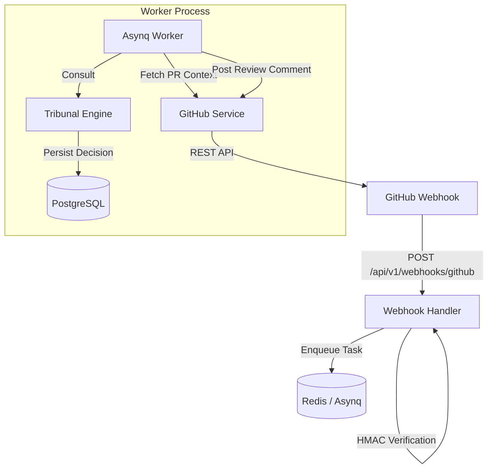

# Technical Specifications: Automated PR Review

**Status**: Draft
**Owner**: DevTeam (Architect)
**Source**: `docs/AUTOMATED_PR_REVIEW_PRD.md`

---

## 1. Overview
The **Automated PR Review** system leverages The Tribunal (Multi-Model Consensus) to automatically audit GitHub Pull Requests. It identifies security risks and architectural inconsistencies before human review.

---

## 2. Architecture

### 2.1 Component Diagram


### 2.2 Integration Detail
-   **Trigger**: GitHub `pull_request` event (opened, synchronize, reopened).
-   **Processing**: Asynchronous via `Asynq` to respond to GitHub webhooks within <1s.
-   **Intelligence**: The Tribunal Engine (Claude Opus, Gemini Code Assist, Gemini Flash).

---

## 3. API Specification

### 3.1 GitHub Webhook Endpoint
**POST /api/v1/webhooks/github**

-   **Headers**: 
    -   `X-Hub-Signature-256`: HMAC-SHA256 signature for verification.
-   **Payload**: Standard GitHub `pull_request` webhook JSON.
-   **Response**: 
    -   `202 Accepted`: Task enqueued.
    -   `401 Unauthorized`: Invalid signature.
    -   `400 Bad Request`: Unsupported event or malformed JSON.

---

## 4. Data Model

### 4.1 Worker Task Payload
```go
const TypeReviewPR = "task:review_pr"

type ReviewPRPayload struct {
    RepoOwner string `json:"repo_owner"`
    RepoName  string `json:"repo_name"`
    PRNumber  int    `json:"pr_number"`
    HeadSHA   string `json:"head_sha"`
}
```

### 4.2 Tribunal Mapping
The `ReviewPRPayload` will be mapped to a `TribunalRequest`:
-   **CaseID**: `GH_{owner}/{repo}#{number}_{sha}`
-   **Intent**: `Automated Audit for PR #{number}`
-   **Context**: Concatenation of PR description and the Git diff (truncated to 10k characters).

---

## 5. Security Considerations

### 5.1 Webhook Verification
-   Must use `crypto/hmac` with `sha256` to verify the `X-Hub-Signature-256` header against the `GITHUB_WEBHOOK_SECRET`.
-   **Constant-time comparison** via `hmac.Equal` to prevent timing attacks.

### 5.2 Secret Management
-   `GITHUB_PAT`: Scoped to `pull_requests:read/write`. Stored as environment variable.
-   `GITHUB_WEBHOOK_SECRET`: Stored as environment variable.

---

## 6. Testing Strategy

### 6.1 Unit Tests
-   `signature_test.go`: Verify HMAC logic with valid/invalid signatures.
-   `payload_test.go`: Verify extraction of PR details from GitHub JSON.

### 6.2 Integration Tests
-   `github_integration_test.go`: Use `httptest` to mock GitHub API and verify commenting logic.
-   `worker_review_test.go`: Verify that enqueuing a PR task results in a `TribunalDecision` in the DB.

---

## 7. Implementation Notes

### 7.1 GitHub Service
-   Introduce `internal/service/github_service.go`.
-   Responsibilities: Fetching PR diffs and posting comments.

### 7.2 Idempotency
-   Before processing a task, check `tribunal_decisions` for an existing `case_id` matching the Head SHA. If found, skip processing to avoid duplicate comments on the same commit.

### 7.3 Fail-Closed
-   If `GITHUB_PAT` or `GITHUB_WEBHOOK_SECRET` is missing, the server must log a CRITICAL error and return `500 Internal Server Error` for all webhook attempts.
