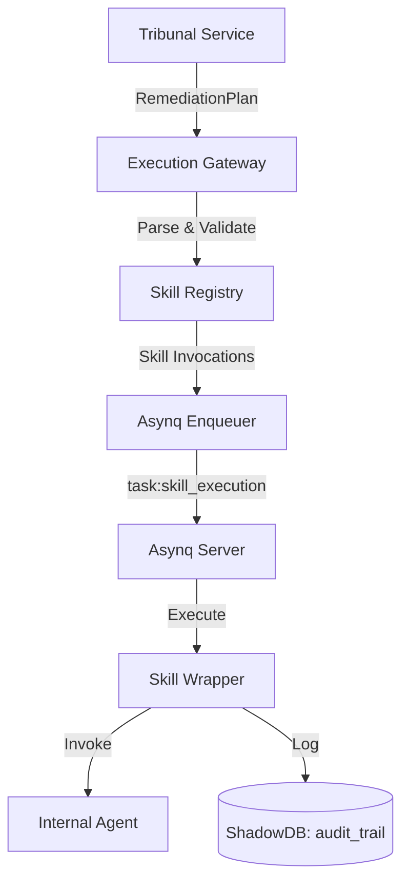

# FUTURESHADE_AGENTS Technical Specification

**Status**: Published
**Owner**: DevTeam
**Task ID**: `FUTURESHADE_AGENTS`
**Roadmap Step**: 67

## 1. Overview
The `FUTURESHADE_AGENTS` system bridges the gap between FutureShade's Tribunal decisions and the execution of those decisions via `internal/agents`. It introduces a standardized `Skill` interface, an `ExecutionGateway` for parsing plans, and an Asynq-based worker pipeline for reliable, asynchronous execution.

## 2. Architecture

### 2.1 Component Diagram


## 3. The Skill Interface
Every internal agent will be wrapped in a `Skill` implementation.

```go
package skills

type Result struct {
    Success bool
    Summary string
    Data    map[string]interface{}
}

type Skill interface {
    ID() string
    Execute(ctx context.Context, params map[string]interface{}) (Result, error)
}
```

### 3.1 Initial Skill Implementations
- `procurement_sync`: Wraps `agents.ProcurementAgent.Execute`.
- `daily_focus_sync`: Wraps `agents.DailyFocusAgent.Execute`.
- `schedule_recalc`: Wraps `service.ScheduleService.RecalculateSchedule`.

## 4. Execution Gateway
The `ExecutionGateway` is responsible for parsing the `RemediationPlan` string (JSON) from the Tribunal and enqueuing tasks.

### 4.1 Plan Parsing logic
```go
type RemediationPlan struct {
    Actions []struct {
        SkillID string                 `json:"skill_id"`
        Params  map[string]interface{} `json:"params"`
    } `json:"actions"`
}
```

## 5. Worker Integration
A new task type `task:skill_execution` will be added to `internal/worker`.

### 5.1 Task Payload
```go
type SkillExecutionPayload struct {
    DecisionID uuid.UUID              `json:"decision_id"`
    SkillID    string                 `json:"skill_id"`
    Params     map[string]interface{} `json:"params"`
}
```

## 6. Data Model (Database Migrations)
A new migration is required to support the audit trail.

### 6.1 `shadow_execution_logs` Table
```sql
CREATE TABLE shadow_execution_logs (
    id UUID PRIMARY KEY,
    decision_id UUID NOT NULL REFERENCES tribunal_decisions(id),
    skill_id TEXT NOT NULL,
    parameters JSONB NOT NULL,
    status TEXT NOT NULL, -- 'PENDING', 'RUNNING', 'COMPLETED', 'FAILED'
    result_summary TEXT,
    error_message TEXT,
    started_at TIMESTAMP WITH TIME ZONE,
    finished_at TIMESTAMP WITH TIME ZONE,
    created_at TIMESTAMP WITH TIME ZONE DEFAULT NOW()
);
```

## 7. Security & Risk Controls
- **Validation**: The `ExecutionGateway` must validate that all `SkillID`s exist in the `Registry`.
- **Constraint Enforcement**: Skills must define valid parameter ranges (e.g., `batch_size` > 0).
- **Circuit Breaker**: A global `Enabled` flag in `futureshade.Config` must stop all enqueuing.

## 8. Testing Strategy
- **Unit Tests**: Test `RemediationPlan` parsing in the `ExecutionGateway`.
- **Integration Tests**: Verify that `task:skill_execution` correctly invokes a mocked `Skill`.
- **E2E Simulation**: Trigger a Tribunal review and verify that an audit log is created when the plan is enqueued.
