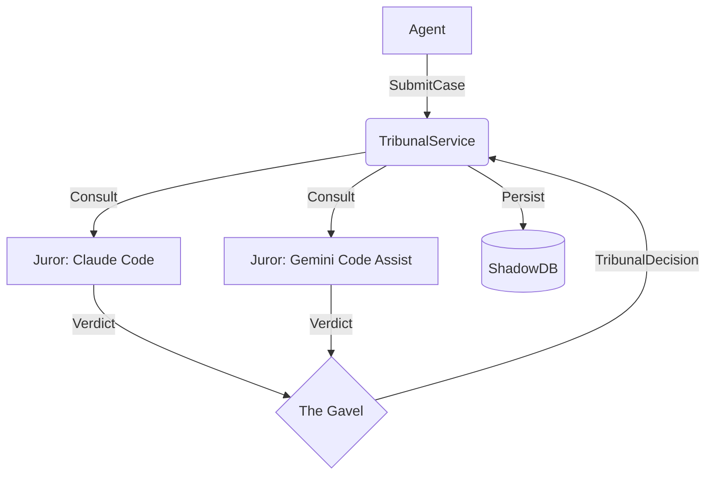

# TRIBUNAL_INTERFACES Technical Specifications

## 1. Overview
"The Tribunal" is a consensus engine within the FutureShade intelligence layer designed to mitigate hallucinations and increase decision confidence. It achieves this by querying multiple "Juror" models—specifically **Claude Code** and **Gemini Code Assist**—and synthesizing their outputs through a configurable "Gavel" logic. This architecture decouples the agent from single-model dependencies and provides a robust audit trail.

## 2. Architecture

The system follows a hexagonal architecture, with the `TribunalService` at the core, driven by the `ConsensusEngine` ("The Gavel"), and interacting with external models via the `MultiModelClient`.

### Core Components
*   **`TribunalService`**: The primary entry point for agents to submit "Cases". It orchestrates the flow between the client adapters and the consensus engine.
*   **`Juror` (Interface)**: An abstraction for an LLM provider. Implementations will exist for:
    *   `ClaudeJuror` (Claude Code adapter)
    *   `GeminiJuror` (Gemini Code Assist adapter)
*   **`TheGavel` (Interface)**: The logic unit that accepts a set of `Verdicts` and produces a final `TribunalDecision`. Strategies include `Unanimous`, `MajorityRule`, and `Supervisor`.
*   **`ShadowDB`**: Persistence layer for auditability, storing every Case, Verdict, and Decision.



## 3. API Specification (Go Interfaces)

### 3.1 Domain Types (`internal/futureshade/types`)

```go
package types

import "context"

type ModelID string

const (
    ModelClaudeCode  ModelID = "claude-code"
    ModelGeminiCode  ModelID = "gemini-code-assist"
)

type ConsensusStrategy string

const (
    StrategyUnanimous    ConsensusStrategy = "UNANIMOUS"
    StrategyMajority     ConsensusStrategy = "MAJORITY_RULE"
    StrategySupervisor   ConsensusStrategy = "SUPERVISOR"
)

// Case represents a request for judgment.
type Case struct {
    ID                string
    Context           string            // File content, diffs, etc. (Max 100KB)
    Instructions      string            // What to do with the context
    RequiredConsensus ConsensusStrategy
    Jurors            []ModelID
}

// Validation Constants
const (
    MaxContextSize = 100 * 1024 // 100KB limit to prevent token overflow
)

// Verdict is a single model's response.
type Verdict struct {
    ModelID   ModelID
    Content   string
    Confidence float64
    LatencyMs int64
    CostUSD   float64
}

// TribunalDecision is the final synthesized result.
type TribunalDecision struct {
    ID                 string
    CaseID             string
    FinalRuling        string
    ConsensusReached   bool
    DissentingOpinions []Verdict
    Metadata           map[string]interface{}
}
```

### 3.2 Service Interfaces (`internal/futureshade/interfaces`)

```go
package interfaces

import (
    "context"
    "github.com/futurebuildai/futurebuild-repo/internal/futureshade/types"
)

// Juror represents a single LLM provider.
type Juror interface {
    Consult(ctx context.Context, c types.Case) (types.Verdict, error)
    ID() types.ModelID
}

// TheGavel decides the outcome based on verdicts.
type TheGavel interface {
    Deliberate(strategy types.ConsensusStrategy, verdicts []types.Verdict) (types.TribunalDecision, error)
}

// TribunalService is the public API.
type TribunalService interface {
    Adjudicate(ctx context.Context, c types.Case) (types.TribunalDecision, error)
}
```

## 4. Data Model

We will use the existing Postgres database with a new schema `futureshade`.

### Tables

1.  **`futureshade.cases`**
    *   `id` (UUID, PK)
    *   `context` (TEXT)
    *   `instructions` (TEXT)
    *   `strategy` (VARCHAR)
    *   `created_at` (TIMESTAMPTZ)

2.  **`futureshade.verdicts`**
    *   `id` (UUID, PK)
    *   `case_id` (UUID, FK)
    *   `model_id` (VARCHAR)
    *   `content` (TEXT)
    *   `confidence` (FLOAT)
    *   `cost_usd` (DECIMAL)

3.  **`futureshade.decisions`**
    *   `id` (UUID, PK)
    *   `case_id` (UUID, FK)
    *   `final_ruling` (TEXT)
    *   `consensus_reached` (BOOLEAN)
    *   `created_at` (TIMESTAMPTZ)

## 5. Security Considerations

*   **API Key Management**: API keys for Claude Code and Gemini Code Assist MUST be retrieved from the Secret Manager at runtime. They should never be stored in code or environment variables committed to the repo.
*   **Context Sanitization**: Before sending data to Jurors, the `TribunalService` must sanitize the input to prevent prompt injection attacks (e.g., stripping "Ignore previous instructions" patterns).
*   **Input Validation**: `Context` payload must not exceed `MaxContextSize`.
*   **Audit Trail**: All decisions are immutable once written to `ShadowDB`.
*   **Fail-Safe**: If `ShadowDB` is unavailable, the Tribunal must return an error (Fail Closed) to ensure no un-audited decisions are made.

## 6. Testing Strategy

*   **Unit Tests**:
    *   Test `TheGavel` strategies with table-driven tests (e.g., specific combinations of agreeing/disagreeing verdicts).
    *   Mock `Juror` interfaces to simulate timeouts, hallucinations, and API errors.
*   **Integration Tests**:
    *   "Golden Thread" for Tribunal: Create a Case -> Mocked Jurors return fixed responses -> Verify Decision is persisted to DB.

## 7. Implementation Notes

*   **Concurrency**: Calls to `Juror.Consult` should happen in parallel using Goroutines and `errgroup`.
*   **Timeouts**: Enforce a strict timeout (e.g., 30s) for the entire adjudication process. If a Juror times out, treat it as an abstention or failure.
*   **Resiliency**: Implement a single retry with exponential backoff for 5xx errors from Juror APIs. Do not retry on 4xx errors.
*   **Cost Tracking**: Estimate tokens before sending and record usage returned by APIs to track burn rate.
